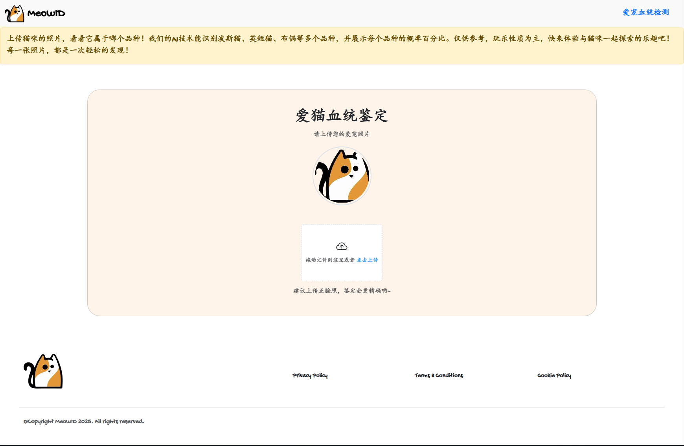
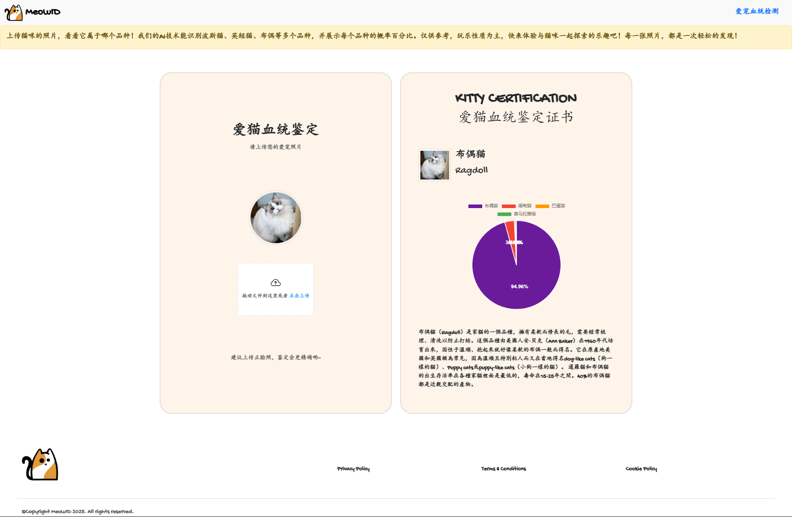

# 猫咪品种分类器


本项目开发了一款基于深度学习的猫咪品种识别应用，用户可以通过上传猫咪的图片，应用会自动识别并分类猫咪的品种，并输出每个品种的概率百分比。通过该应用，用户能够轻松了解自己猫咪的品种，同时获得相关的品种信息。

本项目实现了一个基于 PyTorch 的猫咪品种分类模型。该模型使用一个包含猫咪图片的训练数据集，能够对不同品种的猫咪进行精准分类。在模型构建过程中，采用了 ResNet-50 预训练模型，并对其进行了微调，以实现最佳的分类效果。  

为了提升用户体验，我使用 Vue 构建了一个直观的 Web 应用，用户可以轻松上传图片并查看识别结果。项目的源代码在 （https://github.com/terenzzzz/MeowID ）


### 资料来源
- Aml的数据集：https://github.com/Aml-Hassan-Abd-El-hamid

# 核心技术：
- **深度学习框架**：本项目基于 PyTorch 构建了猫咪品种分类模型。为了提高分类的准确性，采用了 ResNet-50 预训练模型，并进行了 微调 (Fine-tuning)，以适应猫咪品种的特定分类需求。
- **模型封装与 API 提供**：模型通过 Flask 构建为一个 Web 服务，用户可以通过 HTTP 请求上传猫咪图片，API 会返回猫咪品种的预测结果和对应的概率。

# 使用方法  

1. **环境依赖**  
   请确保已安装以下依赖库：  
   - Python 3.x  
   - PyTorch  
   - torchvision  
   - tqdm  
   - numpy  

   使用以下命令安装依赖：  
   ```bash
   pip install Flask Flask-Cors Pillow numpy tqdm
   #CPU版本
   pip install torch torchvision torchaudio
   #Cuda版本
   pip install torch==2.5.1+cu126 torchvision==0.20.1+cu126 torchaudio==2.5.1 -f https://download.pytorch.org/whl/torch_stable.html 
2. **数据集准备**  
   数据集需分为 `train` 和 `test` 文件夹，目录结构如下：  
   ```plaintext
   ├── train/
   │   ├── breed_1/
   │   ├── breed_2/
   │   └── ...
   ├── test/
   │   ├── breed_1/
   │   ├── breed_2/
   │   └── ...
3. **训练模型**  
   修改 **CatBreedClassifier.py** 脚本中的数据集路径：
   ```bash  
   TRAIN_DIR = "你的训练数据集路径"
   TEST_DIR = "你的测试数据集路径"
   ```

   
   运行以下命令开始训练模型：
    ```bash
   python CatBreedClassifier.py
    ```
4. **评估模型**
在训练完成后，模型会自动评估测试数据集的分类准确率，并输出每个品种的分类准确度。

5. **保存模型**
训练结束后，过程中表现最佳的模型会保存为 app/model.pt，以供后续提供服务。

6. **运行API服务**  
  模型保存后，使用以下指令运行API服务：
    ```bash
    python app/app.py
    ```
   该命令会启动 Flask Web 服务器，默认监听在本地的 5000 端口。
   API 将提供如下请求链接
     ```bash
     http://localhost:5000/pridictBreed
     ```
   通过 HTTP **POST** 请求将猫咪图片上传到该链接，服务器将返回猫咪品种的识别结果及其对应的概率百分比。  
   以表单格式上传文件，字段名为 file，文件类型可以是 .jpg, .png, .jpeg 等

   成功上传并识别后，API 会返回 JSON 格式的响应数据，示例如下：
   ```json
      {
       "message": "File successfully uploaded and processed",
       "prediction": [
           {
               "en": "Ragdoll",
               "probability": 0.9495545625686646,
               "zh": "布偶猫"
           },
           {
               "en": "Birman",
               "probability": 0.034615058451890945,
               "zh": "缅甸猫"
           },
           {
               "en": "Balinese",
               "probability": 0.0039695934392511845,
               "zh": "巴厘猫"
           },
           {
               "en": "Himalayan",
               "probability": 0.003602612530812621,
               "zh": "喜马拉雅猫"
           }
       ]
      }
     ```
7. **部署服务**
   启动 gunicorn 来运行应用：
   ```bash
   nohup gunicorn -w 4 -b 0.0.0.0:5000 app:app &
   ```
   使用Nginx反向代理:
   ```bash
      server {
       # 需要被监听的端口号，前提是此端口号没有被占用，否则在重启 Nginx 时会报错
       listen       5001 ssl;
           server_tokens off;
           keepalive_timeout 5;
           # 配置域名
           server_name www.terenzzzz.cn;
           #填写您的证书文件名称
           ssl_certificate terenzzzz.cn.pem;
           #填写您的私钥文件名称
           ssl_certificate_key terenzzzz.cn.key;
           ssl_session_timeout 5m;
           # 可参考此 SSL 协议进行配置
           ssl_protocols TLSv1 TLSv1.1 TLSv1.2;
           #可按照此加密套件配置，写法遵循 openssl 标准
           ssl_ciphers ECDHE-RSA-AES128-GCM-SHA256:HIGH:!aNULL:!MD5:!RC4:!DHE;
           ssl_prefer_server_ciphers on;
   
   
       client_max_body_size 20m;
       client_body_buffer_size 128k;
   
       # 根请求会指向的页面
           location / {
           proxy_pass http://localhost:5000;
          }
      }
   ```
   

# 训练和测试结果

- **train Loss**: 0.4772  
- **train Accuracy**: 88.38%

- **test Loss**: 1.2168  
- **test Accuracy**: 64.17%


### 每个品种的模型准确率

| 品种 (Class)                                      | ID   | 准确率 (Accuracy) |
|---------------------------------------------------|------|------------------|
| Abyssinian                                        | 0    | 93.55%           |
| American Curl                                     | 1    | 15.15%           |
| American Shorthair                                | 2    | 22.58%           |
| Balinese                                          | 3    | 24.56%           |
| Bengal                                            | 4    | 90.32%           |
| Birman                                            | 5    | 87.10%           |
| Bombay                                            | 6    | 92.47%           |
| British Shorthair                                 | 7    | 84.95%           |
| Burmese                                           | 8    | 18.33%           |
| Cornish Rex                                       | 9    | 48.72%           |
| Devon Rex                                         | 10   | 45.95%           |
| Egyptian Mau                                      | 11   | 87.78%           |
| Exotic Shorthair                                  | 12   | 34.69%           |
| Extra-Toes Cat - Hemingway Polydactyl             | 13   | 28.79%           |
| Havana                                            | 14   | 25.00%           |
| Himalayan                                         | 15   | 50.59%           |
| Japanese Bobtail                                  | 16   | 32.26%           |
| Korat                                             | 17   | 4.17%            |
| Maine Coon                                        | 18   | 89.25%           |
| Manx                                              | 19   | 30.61%           |
| Nebelung                                          | 20   | 51.35%           |
| Norwegian Forest Cat                              | 21   | 41.67%           |
| Oriental Short Hair                               | 22   | 21.62%           |
| Persian                                           | 23   | 93.55%           |
| Ragdoll                                           | 24   | 76.92%           |
| Russian Blue                                      | 25   | 93.48%           |
| Scottish Fold                                     | 26   | 72.60%           |
| Selkirk Rex                                       | 27   | 29.17%           |
| Siamese                                           | 28   | 92.31%           |
| Siberian                                          | 29   | 10.81%           |
| Snowshoe                                          | 30   | 71.76%           |
| Sphynx                                            | 31   | 100.00%          |
| Tonkinese                                         | 32   | 22.03%           |
| Toyger tiger cat                                  | 33   | 58.24%           |
| Turkish Angora                                    | 34   | 80.49%           |


---



